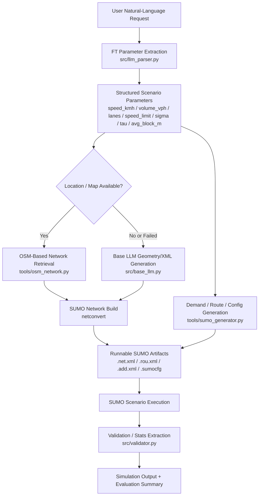
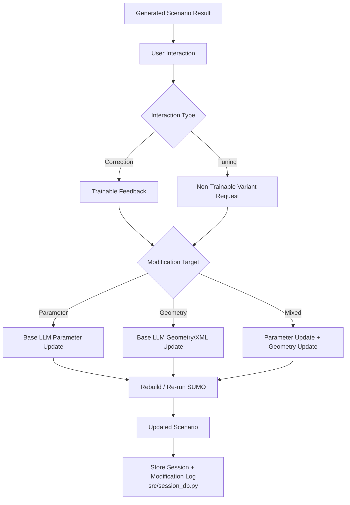
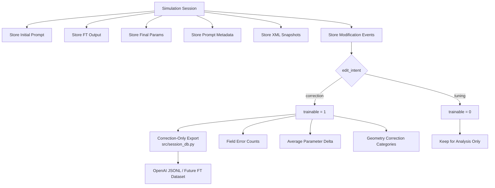
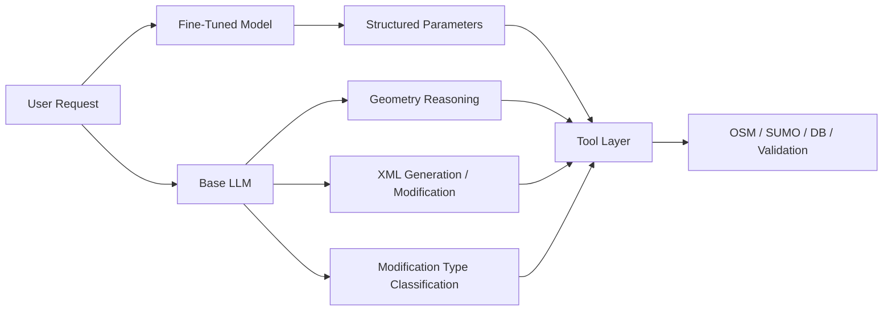
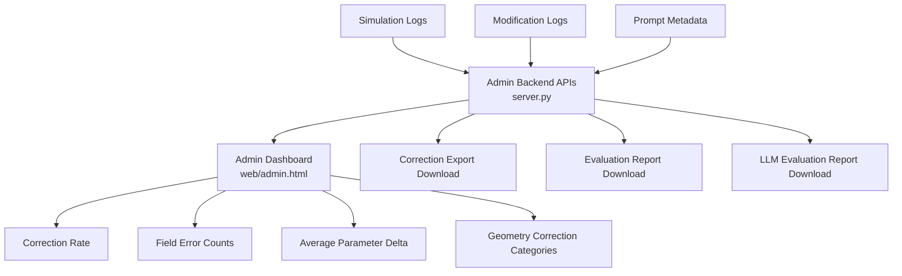
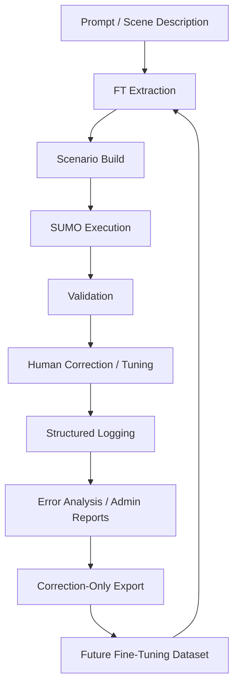

# Pipeline Diagram Reference

This document contains standalone Mermaid versions of the main pipeline diagrams. The primary version now lives in [README.md](README.md).

Key points:

- the fine-tuned model converts natural language into structured parameters
- the base LLM handles geometry and XML reasoning
- SUMO acts as the synthetic scenario execution engine
- user interactions are stored as either `correction` or `tuning`
- only `correction` records are exported as retraining signals by default

## 1. End-to-End Generation Pipeline

## 2. Human-in-the-Loop Refinement Pipeline

## 3. Retraining Data Pipeline

## 4. Model / Tool Role Separation

## 5. Admin / Evaluation Pipeline

## 6. Full Closed Loop

