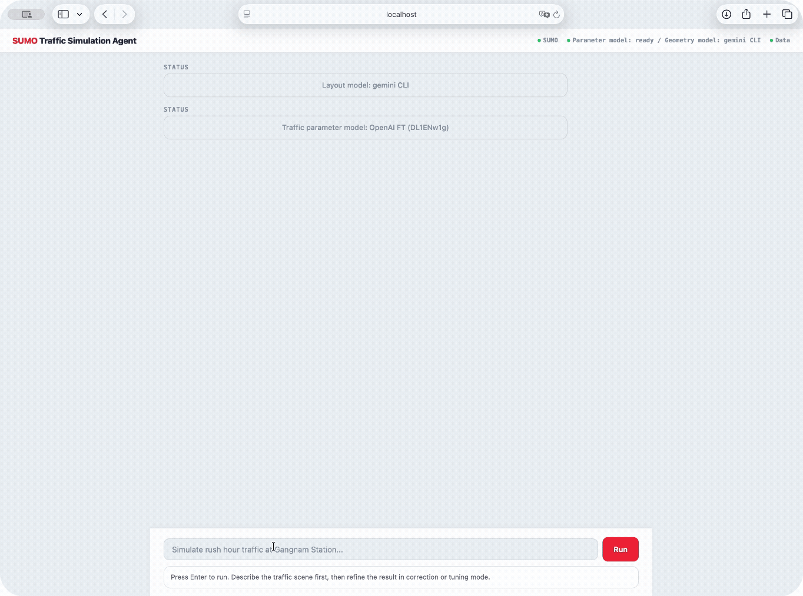
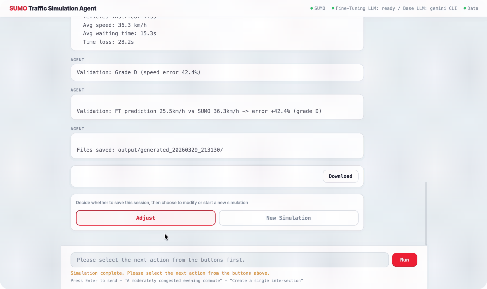
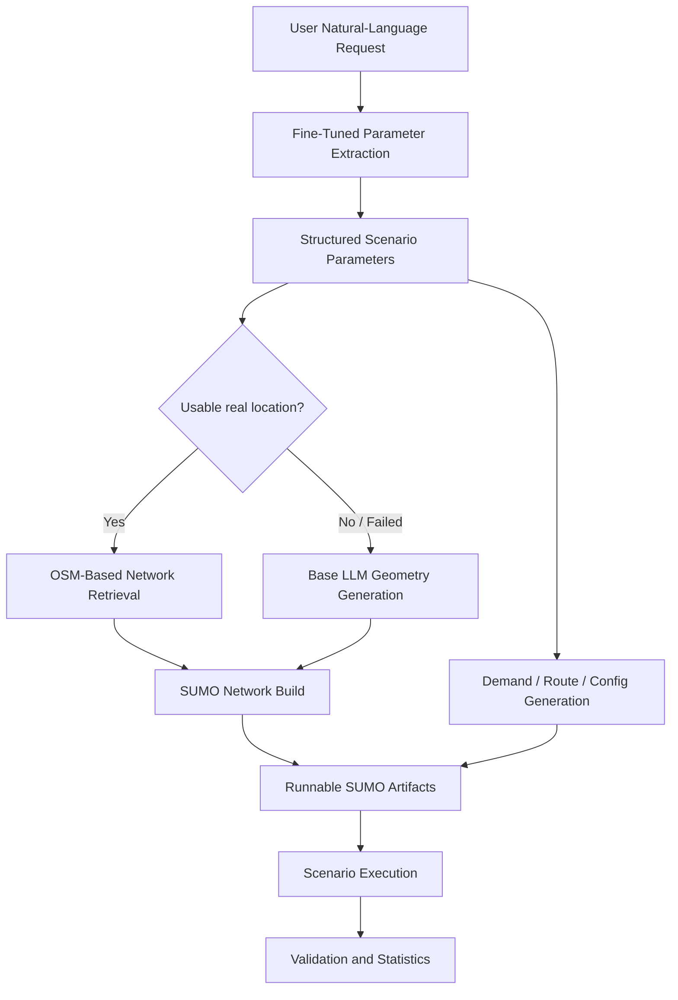
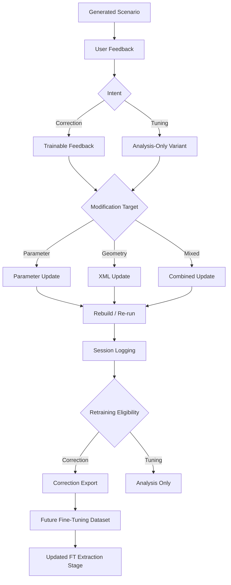
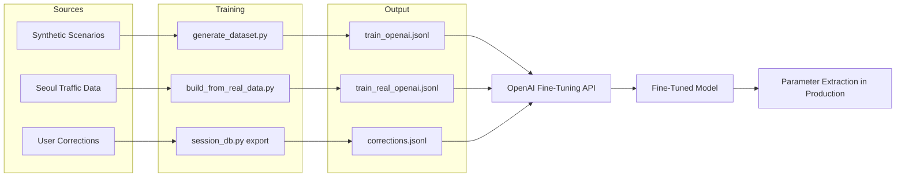

# LLM-Guided Synthetic Driving Scenario Generation

A role-separated LLM workflow that converts natural-language traffic descriptions into structured SUMO driving scenarios. A fine-tuned model handles parameter extraction (overall MAPE 10.6% vs 51.5% base model, 0% JSON parsing failures), a base LLM handles geometry reasoning, and an 11-tool agent orchestrates execution. Human corrections are logged with trainability metadata and exported as retraining data.

**[Live Demo](https://sumo-traffic-agent-66pav72ktq-an.a.run.app/about)** · **[GitHub](https://github.com/sewon-p/sumo-traffic-agent)**

## Overview

This project addresses the cost of building realistic synthetic driving scenarios through a role-separated LLM workflow:

1. A user describes a traffic scene in natural language.
2. A **fine-tuned model** extracts structured simulation parameters.
3. A **base LLM** handles open-ended geometry and XML reasoning.
4. A **tool-calling agent** orchestrates network building, simulation, and validation.
5. Results are validated, and human corrections are logged for future dataset improvement.

The key design choice is **responsibility split** rather than a single model doing everything.

## Demo

### Simulation Run


> **Prompt:** `Simulate a congested 8-lane arterial road during evening rush hour`

### Parameter Correction


> **Correction:** `Speed is too high for rush hour, reduce to under 25 km/h`

### Geometry Modification


> **Adjust:** `Add an intersection on the right side`

*The fine-tuned model is trained on Korean traffic data from Seoul.*

## Problem

Generating realistic traffic scenarios for simulation requires domain knowledge that general-purpose LLMs lack. A single model asked to produce SUMO-compatible parameters tends to default to free-flow speeds, ignore road-type-specific capacity constraints, and hallucinate intersection geometry. The base model in this project overpredicts speed by +68.3% on average and intersection spacing by +165% — errors large enough to make the resulting simulations useless for calibration or testing.

Manual scenario creation is expensive because it requires a traffic engineer to translate each scene description into a consistent set of interrelated parameters: speed depends on V/C ratio, which depends on capacity per lane, which depends on road functional class. Driver behavior parameters like sigma (imperfection) and tau (headway) must be calibrated to the congestion level implied by the scenario, not set independently. Getting any one parameter wrong cascades into unrealistic simulation behavior.

The alternative — fine-tuning a model on domain-specific data and splitting responsibilities across specialized components — is what this project implements. The fine-tuned model learns the parameter interdependencies from real traffic data, while a separate base LLM handles the open-ended geometry reasoning that fine-tuning cannot cover.

## Architecture

### End-to-End Generation Flow



### Human-in-the-Loop Refinement Flow



### Data Flow



## Pipeline

Example input:

```text
"Create a congested morning intersection in front of a middle school."
```

End-to-end output:

```json
// 1. FT model extracts structured parameters
{
  "speed_kmh": 18.5,
  "volume_vph": 2400,
  "lanes": 2,
  "speed_limit_kmh": 30,
  "sigma": 0.72,
  "tau": 0.9,
  "avg_block_m": 120,
  "reasoning": "School zone, 30km/h limit. Morning drop-off congestion, V/C ~0.85."
}

// 2. Network built from OSM or LLM-generated XML -> netconvert
// 3. SUMO runs headless -> avg speed 16.2 km/h, 2380 vehicles inserted
// 4. Validation: FT predicted 18.5 km/h vs SUMO 16.2 km/h -> error -12.4% (grade B)
```

### 1. Fine-tuned parameter extraction

The fine-tuned OpenAI model converts the user request into a structured parameter set:

| Field | Description |
|-------|-------------|
| `speed_kmh` | Predicted average speed under the described conditions |
| `volume_vph` | Vehicles per hour |
| `lanes` | Number of lanes (one direction) |
| `speed_limit_kmh` | Legal speed limit |
| `sigma` | Driver imperfection (0-1) |
| `tau` | Desired time headway (seconds) |
| `avg_block_m` | Average intersection spacing |
| `reasoning` | Domain rationale for the predictions |

### 2. Network generation or retrieval

- Real location available: builds road network from OpenStreetMap.
- Abstract or failed: base LLM generates `.nod.xml` and `.edg.xml`, converted via `netconvert`.

### 3. Scenario execution and refinement

The pipeline generates `.net.xml`, `.rou.xml`, `.add.xml`, `.sumocfg`, then runs SUMO in headless mode.

After generation, the user can continue in two modes:

- **Correction** — marks the result as wrong; becomes trainable feedback
- **Tuning** — requests a variant; logged but excluded from retraining by default

This separation prevents preference edits from polluting fine-tuning signals.

## Fine-Tuning

### Base model

`gpt-4.1-mini` via the OpenAI Fine-Tuning API. Selected for cost efficiency and low latency in structured extraction tasks.

### Training data generation

Two data sources, each with different ground truth methods:

**Synthetic path** ([training/generate_dataset.py](training/generate_dataset.py)):

10 Seoul roads are combined with 6 time periods and 4 weather conditions, plus 15 abstract scenario descriptions. Ground truth is computed using traffic engineering models:

- **Capacity**: per-lane capacity by road functional class (highway 2200, urban expressway 2000, arterial 1800, collector 1200 veh/h/lane)
- **Volume**: capacity x V/C ratio (estimated by time-of-day: peak 0.75-0.95, off-peak 0.45-0.65, late night 0.10-0.25)
- **Speed**: BPR speed-flow function with weather adjustment (rain -15%, snow -30%, fog -20%)

$$v = \frac{v_f}{1 + 0.15 \cdot \left(\frac{V}{C}\right)^4}$$
- **Driver behavior**: `sigma` (imperfection) and `tau` (headway) calibrated by congestion level — congested: sigma 0.6-0.8, tau 0.8-1.2s; free-flow: sigma 0.2-0.4, tau 1.5-2.5s
- **Vehicle composition**: passenger/truck/bus ratios by road category (e.g., highway 78/17/5%, arterial 85/8/7%)

This produces ~70 supervised pairs for initial fine-tuning.

**Real-data path** ([training/build_from_real_data.py](training/build_from_real_data.py)):

Uses actual Seoul traffic survey data (speed survey + volume survey, Seoul Metropolitan Government 2025.10):

1. **Data extraction**: observed speed (31-day hourly average) and traffic volume per road segment from Excel files
2. **Prompt generation**: for each road x time period, rule-based natural language prompts are generated in multiple styles:
   - Road name + time: `"강남대로 퇴근시간 시뮬레이션 해줘"` (Simulate Gangnam-daero evening rush hour)
   - Situational description: `"막히는 서울 도심간선 왕복 8차선 퇴근시간"` (Congested Seoul 8-lane arterial, evening rush)
   - Mixed: `"강남대로 같은 도심간선 퇴근시간 상황"` (Arterial like Gangnam-daero, evening rush situation)
3. **Parameter construction**: speed and volume are observed values; driver behavior parameters (`sigma`, `tau`) are reverse-estimated from observed speed via the Greenshields model

The model learns to predict parameters from **traffic situations** (congestion level + road type + time of day), not just road name lookups. This produces ~245 samples across ~70 road segments, used as validation benchmark ground truth.

### Training process

```bash
# Generate dataset
python -m training.generate_dataset

# Upload and fine-tune
python -m training.fine_tune --provider openai --api-key sk-...
```

The fine-tuning job runs on OpenAI's infrastructure with default hyperparameters. The resulting model ID (`ft:gpt-4.1-mini-...:sumo-traffic:...`) is set as `OPENAI_FT_MODEL` in the environment.

### Production inference

```python
# src/llm_parser.py
client.chat.completions.create(
    model="ft:gpt-4.1-mini-...:sumo-traffic-v2:DL1ENw1g",
    messages=[
        {"role": "system", "content": FT_SYSTEM_PROMPT},
        {"role": "user", "content": user_input},
    ],
    temperature=0.2,
    max_tokens=300,
)
```

The model returns a single JSON object. No post-processing beyond `json.loads()` is needed.

## Prompt Engineering

### System prompt design

The fine-tuned model uses a constrained system prompt (`ft-v1`) that enforces:

- strict JSON-only output (no prose, no markdown)
- all 8 numeric fields required
- value range constraints (`sigma`: 0-1, `tau`: 0.5-3)
- domain reasoning in the `reasoning` field

These constraints reduced JSON parsing failures from ~15% (free-form prompting) to 0% in production.

### Prompt evolution

| Version | Change | Effect |
|---------|--------|--------|
| `rule-v1` | Rule-based keyword matching, no LLM | Baseline; no domain reasoning |
| `ft-v1` | Fine-tuned with structured constraints | 0% format errors, 10.6% overall MAPE |

## Tool-Calling Agent

The project includes a tool-calling agent ([src/agent.py](src/agent.py)) built on the Claude API's tool-use feature. The agent autonomously selects and executes tools based on user requests.

### Available tools (11)

| Tool | Description |
|------|-------------|
| `search_location` | Geocode area names to coordinates |
| `build_road_network` | Build SUMO network from OSM |
| `get_traffic_stats` | Query local Seoul traffic statistics |
| `generate_simulation` | Generate SUMO config files |
| `run_sumo` | Execute simulation |
| `query_topis_speed` | Real-time Seoul traffic API |
| `load_csv_data` | Load external traffic data |
| `recommend_road` | Suggest similar roads |
| `find_similar_roads` | Find roads matching criteria |
| `validate_simulation` | Validate simulation output |
| `calibrate_params` | Calibrate parameters from results |

### Agent loop

```text
User input -> LLM selects tool -> tool execution -> result returned
-> LLM selects next tool or gives final response -> repeat
```

The agent layer currently uses the Claude API's tool-use feature, but the base LLM for other tasks (geometry, modification) is configurable across Claude, GPT, and Gemini.

### Example: abstract request

Input: `"simulate a congested commute road"`

```text
1. search_location("commute road") -> no specific location found
2. get_traffic_stats("arterial", "rush hour") -> capacity/speed references
3. generate_simulation(params) -> .net.xml, .rou.xml, .sumocfg created
4. run_sumo("output/generated.sumocfg") -> avg speed 22.3 km/h, 1850 vehicles
5. validate_simulation(results) -> grade B, speed error -8.2%
   -> Final response with results summary
```

## Fine-Tuning Evaluation

### Benchmark method

30 prompts are sampled from the real-data validation set (~245 samples). Each prompt is sent to both the fine-tuned model and the base model (`gpt-4.1-mini`) with the same system prompt. The model output is parsed as JSON and compared field-by-field against ground truth values derived from observed Seoul traffic data. Metrics: MAPE (mean absolute percentage error) per field, directional bias (over/under-prediction), and output consistency (coefficient of variation across repeated runs).

### Accuracy (MAPE %, lower is better)

| Field | Fine-tuned | Base (gpt-4.1-mini) |
|-------|-----------|---------------------|
| speed_kmh | **5.1%** | 74.6% |
| volume_vph | **34.8%** | 48.1% |
| lanes | **8.9%** | 13.9% |
| speed_limit_kmh | **1.7%** | 23.8% |
| sigma | **4.5%** | 21.3% |
| tau | **4.6%** | 11.4% |
| avg_block_m | **14.5%** | 167.6% |
| **Overall** | **10.6%** | **51.5%** |

The fine-tuned model reduces overall MAPE by ~5x. Output consistency is also higher: CV of 1.47% vs 3.89% for the base model.

### Error Pattern Analysis

Directional bias analysis across 30 samples reveals where each model systematically over- or under-predicts:

| Field | FT Bias | FT Accurate | Base Bias | Base Accurate |
|-------|---------|-------------|-----------|---------------|
| speed_kmh | +0.5% (balanced) | 21/30 | **+68.3% (overpredict)** | 0/30 |
| volume_vph | +25.9% (over) | 13/30 | +21.4% (over) | 3/30 |
| speed_limit_kmh | -1.7% (balanced) | 29/30 | +15.7% (over) | 11/30 |
| sigma | -0.9% (balanced) | 24/30 | +9.9% (over) | 6/30 |
| tau | +1.6% (balanced) | 20/30 | +0.9% (over) | 3/30 |
| avg_block_m | -0.6% (balanced) | 20/30 | **+165.0% (overpredict)** | 1/30 |

Key findings:

- **Base model systematically overpredicts speed** (+68.3% bias, 0/30 accurate). This is the strongest signal that fine-tuning corrects: the base model defaults to free-flow speeds while the FT model learns congested-condition patterns.
- **Base model overpredicts intersection spacing** by 165%, suggesting it lacks domain knowledge about urban block structures.
- **FT volume_vph** has the highest remaining error (MAPE 34.8%, +25.9% bias). This is expected with ~70 training samples — volume is the most context-dependent field and would benefit most from additional training data.
- **FT speed_limit_kmh** is near-perfect (29/30 accurate), showing the model reliably maps road categories to legal speed limits.

### Improvement opportunity

The fine-tuned model was trained on ~70 samples. The `volume_vph` field shows the most room for improvement and would benefit from additional training data covering a wider range of traffic volume scenarios.

Reproduce with:

```bash
python -m evaluation.benchmark --accuracy --samples 30
python -m evaluation.benchmark --all
```

## Dataset

| Source | Samples | Format | Ground Truth |
|--------|---------|--------|--------------|
| Synthetic | ~70 | OpenAI JSONL | BPR function + traffic engineering heuristics |
| Real-data (Seoul) | ~245 | OpenAI JSONL | Observed speed/volume from Seoul traffic data |
| Corrections | grows | Exportable JSONL | Human expert corrections on FT outputs |

### Path 1: Synthetic generation — [training/generate_dataset.py](training/generate_dataset.py)

10 Seoul roads x 6 time periods x 4 weather conditions + 15 abstract scenarios. Speed/volume estimated via BPR model; driver parameters calibrated by congestion level. Used for initial fine-tuning.

### Path 2: Real-data-derived — [training/build_from_real_data.py](training/build_from_real_data.py)

~70 road segments from Seoul traffic surveys. Observed speed/volume paired with rule-based natural language prompts in multiple styles (road name, situational description, mixed). Driver parameters reverse-estimated from observed speed. The model learns situation-to-parameter mapping, not road name lookup. Used for validation benchmark.

### Path 3: Correction-derived — [src/session_db.py](src/session_db.py)

When a user marks a result as **Correction**, the system stores before/after parameter snapshots, modification type, trainability flag, and full event history. Only correction-intent records are exported as retraining JSONL; tuning-intent records are stored for analysis but excluded.

```text
prompt -> FT prediction -> simulation -> human correction -> DB -> export -> retraining
```

## Role-Separated LLM Design

### Fine-tuned extractor — [src/llm_parser.py](src/llm_parser.py)

- Parses natural language into structured simulation parameters
- Provides the machine-readable target for the rest of the pipeline

### Base LLM layer — [src/base_llm.py](src/base_llm.py)

- Classifies modification requests (parameter / geometry / mixed)
- Handles geometry edits and generates fallback XML
- Extracts FT training hints from geometry edits

### Tool-calling agent — [src/agent.py](src/agent.py)

- 11-tool orchestration via Claude API tool-use
- Autonomous tool selection based on user intent
- Multi-turn execution loop

### Logging and export — [src/session_db.py](src/session_db.py)

- Stores simulation runs and modification sessions
- Separates trainable corrections from non-trainable tuning
- Exports retraining JSONL and downloadable reports

## Evaluation and Admin

Database-backed evaluation workflow with auditable, reusable results.

- **LLM-level**: field error rates, correction frequency, average deltas
- **System-level**: scenario fidelity through speed validation and correction statistics

Admin dashboard at `/admin` provides simulation history, modification logs, correction export, and downloadable reports.

## Project Structure

```text
.
├── server.py                     # Web backend and orchestration
├── web/
│   ├── index.html               # Interactive generation UI
│   ├── admin.html               # Admin / evaluation dashboard
│   └── about.html               # Project landing page
├── src/
│   ├── llm_parser.py            # Fine-tuned parameter extraction
│   ├── base_llm.py              # Base-model geometry + modification
│   ├── agent.py                 # Tool-calling agent (11 tools)
│   ├── session_db.py            # Simulation / correction DB and exports
│   ├── validator.py             # Simulation validation
│   └── config.py                # Runtime configuration
├── tools/
│   ├── osm_network.py           # OSM-based network creation
│   ├── sumo_generator.py        # SUMO route/config generation
│   └── network_generator.py     # Fallback synthetic network
├── training/
│   ├── generate_dataset.py      # Synthetic FT dataset generation
│   ├── build_from_real_data.py  # Real-data FT dataset building
│   └── fine_tune.py             # FT workflow helper
├── evaluation/
│   └── benchmark.py             # FT vs base accuracy benchmark
├── data_pipeline/
│   └── collector.py             # Traffic data collection
└── tests/                       # pytest test suite
```

## Running the Project

### Local (recommended for development)

Recommended when local LLM CLIs (gemini, claude, codex) are installed. Docker containers cannot access host CLI tools due to OAuth authentication requirements, so native execution is preferred for full functionality.

```bash
python -m venv .venv
source .venv/bin/activate
pip install -r requirements.txt
python server.py
```

### Docker

```bash
docker compose up --build
```

Then open:
- `http://localhost:8080/` — simulation UI
- `http://localhost:8080/admin` — admin dashboard
- `http://localhost:8080/about` — project overview

### Environment Variables

Copy `.env.example` to `.env` and fill in:

| Variable | Required | Description |
|----------|----------|-------------|
| `OPENAI_API_KEY` | Yes | Fine-tuned parameter extraction |
| `OPENAI_FT_MODEL` | Yes | Fine-tuned model ID |
| `TOPIS_API_KEY` | No | Seoul real-time traffic API |
| `ANTHROPIC_API_KEY` | No | Claude API for base LLM / agent |
| `GEMINI_API_KEY` | No | Gemini API |

## CI/CD and Deployment

### GitHub Actions Pipeline

Pushes to `main` trigger:

1. **test** — `pytest tests/`
2. **docker-build** — build image and verify container health
3. **deploy** — deploy to Cloud Run (when secrets are configured)

### GCP Cloud Run

| Secret | Description |
|--------|-------------|
| `GCP_PROJECT_ID` | GCP project ID |
| `GCP_SA_KEY` | Service account JSON key |

Deployment target: `asia-northeast1` (Tokyo), 1Gi memory, max 3 instances.

## Testing

```bash
pytest tests/ -v
```

Covers configuration loading, validation logic, correction storage/export, and chat session parsing.

## Lessons Learned

- **Structured extraction is a better fine-tuning target than open-ended generation.** Parameter extraction with constrained JSON output converged quickly (~70 samples), while geometry/XML generation remains fragile and better suited to a base LLM with in-context examples.
- **Correction vs tuning separation matters for data quality.** Without this split, preference-driven edits would pollute the retraining signal. The distinction is simple to implement but has a large effect on exported dataset quality.
- **Volume is the hardest field to predict.** At 34.8% MAPE it is the FT model's weakest point — volume is the most context-dependent parameter and would benefit most from additional training data covering a wider range of scenarios.
- **External dependencies need graceful fallback.** OSM lookups and public APIs fail often enough that the LLM-generated XML fallback path is not optional — it is a core part of the pipeline.
- **Evaluation should include cross-domain generalization.** The current benchmark covers Seoul roads; testing on unseen cities or road types would reveal how much the model has learned general traffic engineering vs Seoul-specific patterns.

## License

This project is developed as a personal portfolio project and is not currently licensed for redistribution.
