# LLM-Guided Synthetic Driving Scenario Generation

A role-separated LLM workflow that converts natural-language traffic descriptions into structured SUMO driving scenarios.

A fine-tuned model handles parameter extraction (overall MAPE 10.6% vs 51.5% base model, 0% JSON parsing failures), a geometry LLM handles edit classification and road layout reasoning, and an 11-tool agent orchestrates execution. Human corrections are stored in SQLite with trainability metadata and exported as retraining data.

**[Live Demo](https://sumo-traffic-agent-66pav72ktq-an.a.run.app/about)** · **[GitHub](https://github.com/sewon-p/sumo-traffic-agent)**

<p align="center">
  
</p>

---

## Table of Contents

- [Overview](#overview)
- [Demo](#demo)
- [Problem](#problem)
- [Architecture](#architecture)
- [Pipeline](#pipeline)
- [Prompt Engineering](#prompt-engineering)
- [Regulation RAG](#regulation-rag)
- [Runtime Parameter Wiring and Calibration](#runtime-parameter-wiring-and-calibration)
- [Fine-Tuning](#fine-tuning)
- [Fine-Tuning Evaluation](#fine-tuning-evaluation)
- [Tool-Calling Agent](#tool-calling-agent)
- [Dataset](#dataset)
- [Role-Separated LLM Design](#role-separated-llm-design)
- [Evaluation and Admin](#evaluation-and-admin)
- [Token Usage and Cost Observability](#token-usage-and-cost-observability)
- [Project Structure](#project-structure)
- [Running the Project](#running-the-project)
- [Lessons Learned](#lessons-learned)

---

## Overview

This project addresses the cost of building realistic synthetic driving scenarios through a role-separated LLM workflow:

1. A user describes a traffic scene in natural language.
2. A **fine-tuned model** extracts structured simulation parameters.
3. A **geometry LLM** classifies edits and handles geometry and XML reasoning.
4. A **tool-calling agent** orchestrates network building, simulation, and validation.
5. Results are validated, and human corrections are logged for future dataset improvement.

The key design choice is **responsibility split** rather than a single model doing everything.

The repository exposes this workflow through two user-facing entrypoints: a browser UI served by `server.py` and a terminal chat interface in `chat.py`. The browser flow adds progress streaming, network preview, downloadable SUMO artifacts, and an admin dashboard for correction analysis.

---

## Demo

The interface runs through five phases in a single conversation:

### 1. LLM Selection


Choose the base model for geometry reasoning — shared server Gemini, local CLI (claude/gemini/codex), or your own API key.

### 2. Prompt & Run


`Simulate a congested 6-lane arterial road during evening rush hour`

Describe a traffic scene in natural language. The fine-tuned model extracts parameters, the agent builds the network, and SUMO executes the scenario.

### 3. Correction & Tuning

| Parameter Correction | Geometry Modification |
|:---:|:---:|
|  | 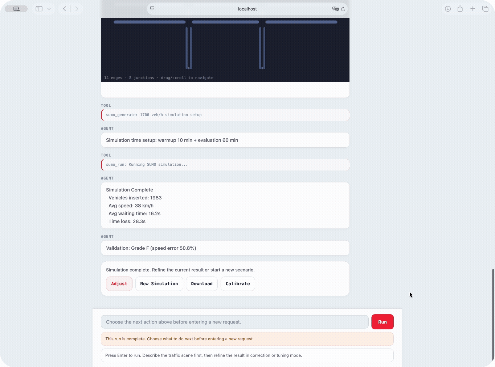 |
| `Increase traffic volume to 1700 veh/h` | `Add an intersection on the right side` |

- **Correction** — marks the result as wrong; the delta becomes retraining data
- **Tuning** — requests a variant; logged but excluded from retraining

---

## Problem

Generating realistic traffic scenarios for simulation requires domain knowledge that general-purpose LLMs lack. A single model asked to produce SUMO-compatible parameters tends to default to free-flow speeds, ignore road-type-specific capacity constraints, and hallucinate intersection geometry. The base model in this project overpredicts speed by +68.3% on average and intersection spacing by +165% — errors large enough to make the resulting simulations useless for calibration or testing.

Manual scenario creation is expensive because it requires a traffic engineer to translate each scene description into a consistent set of interrelated parameters: speed depends on V/C ratio, which depends on capacity per lane, which depends on road functional class. Driver behavior parameters like sigma (imperfection) and tau (headway) must be calibrated to the congestion level implied by the scenario, not set independently. Getting any one parameter wrong cascades into unrealistic simulation behavior.

The alternative — fine-tuning a model on domain-specific data and splitting responsibilities across specialized components — is what this project implements. The fine-tuned model learns the parameter interdependencies from real traffic data, while a geometry LLM handles the open-ended geometry reasoning.

## Architecture

### System Overview

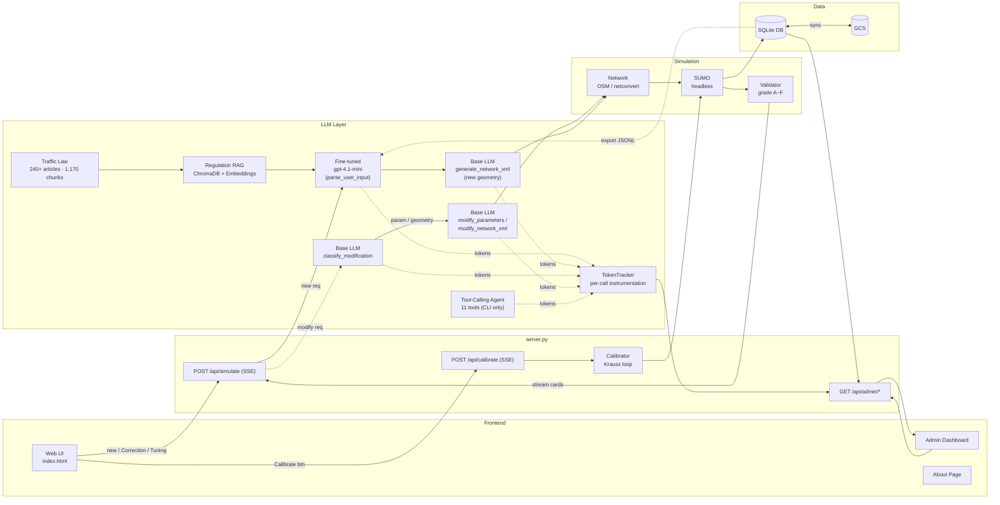

### End-to-End Generation Flow

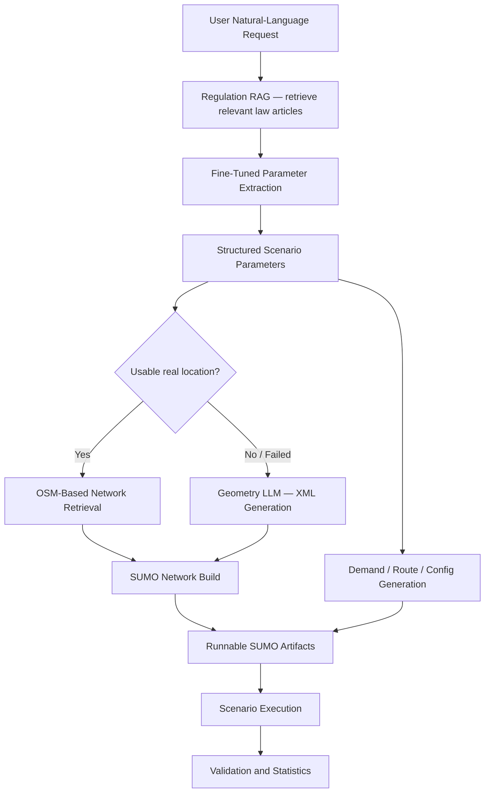

### Human-in-the-Loop Refinement Flow

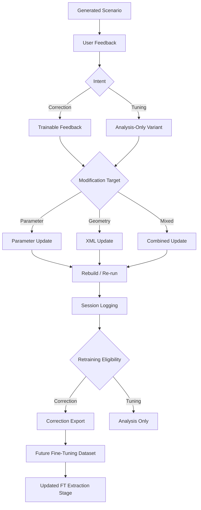

### Data Flow

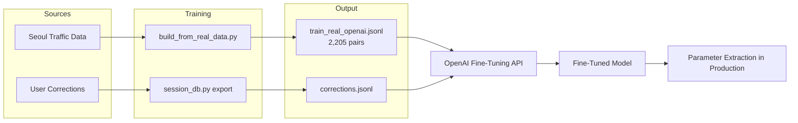

## Pipeline

Example input:

```text
"Create a congested morning intersection in front of a middle school."
```

End-to-end output:

```json
// 1. FT model extracts structured parameters
{
  "speed_kmh": 18.5,
  "volume_vph": 2400,
  "lanes": 2,
  "speed_limit_kmh": 30,
  "sigma": 0.72,
  "tau": 0.9,
  "avg_block_m": 120,
  "reasoning": "School zone, 30km/h limit. Morning drop-off congestion, V/C ~0.85."
}

// 2. Network built from OSM or LLM-generated XML -> netconvert
// 3. SUMO runs headless -> avg speed 16.2 km/h, 2380 vehicles inserted
// 4. Validation: FT predicted 18.5 km/h vs SUMO 16.2 km/h -> error -12.4% (grade B)
```

### 1. Fine-tuned parameter extraction

The fine-tuned OpenAI model converts the user request into a structured parameter set:

| Field | Description |
|-------|-------------|
| `speed_kmh` | Predicted average speed under the described conditions |
| `volume_vph` | Vehicles per hour |
| `lanes` | Number of lanes (one direction) |
| `speed_limit_kmh` | Legal speed limit |
| `sigma` | Driver imperfection (0-1) |
| `tau` | Desired time headway (seconds) |
| `avg_block_m` | Average intersection spacing |
| `reasoning` | Domain rationale for the predictions |

### 2. Network generation or retrieval

- Real location available: builds road network from OpenStreetMap.
- Abstract or failed: geometry LLM generates `.nod.xml` and `.edg.xml`, converted via `netconvert`.

### 3. Scenario execution and refinement

The pipeline generates `.net.xml`, `.rou.xml`, `.add.xml`, `.sumocfg`, then runs SUMO in headless mode.

After generation, the user can continue in two modes:

- **Correction** — marks the result as wrong; becomes trainable feedback
- **Tuning** — requests a variant; logged but excluded from retraining by default

This separation prevents preference edits from polluting fine-tuning signals.

In the web UI, execution progress is streamed incrementally with SSE, the generated network can be previewed directly in the chat, the latest output directory can be downloaded as a ZIP, and an existing scenario can be reopened in `sumo-gui` for manual inspection.

## Prompt Engineering

The fine-tuned model uses a constrained system prompt (`ft-v1`) that enforces strict JSON output, required fields, value-range constraints, and domain calibration rules. This is not a minor detail — without these constraints the model intermittently returned prose, markdown, or partial JSON, making the downstream pipeline unreliable.

### System prompt (ft-v1)

```text
You are a traffic engineering expert and SUMO simulation engineer.
When the user describes a road/traffic situation, return only JSON
with the parameters needed for SUMO simulation.
You must fill all 8 fields below with numbers.
Never use empty values or the string '-'.

Calibration rules:
- School/school zone: speed_limit_kmh=30, sigma high (0.6+)
- Highway/expressway: speed_limit_kmh=80~100, avg_block_m 500+
- Side street/alley: speed_limit_kmh=30, lanes=1, avg_block_m 50~80
- Morning/evening rush: volume high, speed low
- Late night: volume very low, speed high

Output format:
{"speed_kmh": number, "volume_vph": number, "lanes": one-way lane count,
 "speed_limit_kmh": number, "sigma": between 0~1, "tau": between 0.5~3,
 "avg_block_m": intersection spacing (m), "reasoning": "rationale"}
```

### Prompt constraints and their effects

| Constraint | Why it matters |
|------------|----------------|
| JSON-only output, no prose | Without this, ~15% of responses included markdown or explanatory text that broke `json.loads()` |
| All 8 fields required, no empty values | Prevents partial outputs that crash downstream SUMO file generation |
| `sigma` 0–1, `tau` 0.5–3 range enforcement | SUMO Krauss model breaks on out-of-range values |
| Domain calibration rules in prompt | Anchors predictions to traffic engineering reality (school zones, highways, rush hours) |
| `reasoning` field required | Forces the model to justify its predictions, improving consistency |

### Example inference

**Input**: `"Simulate a congested 6-lane arterial road during evening rush hour"`

**Output**:
```json
{
  "speed_kmh": 23.2,
  "volume_vph": 2157,
  "lanes": 3,
  "speed_limit_kmh": 60,
  "sigma": 0.47,
  "tau": 1.3,
  "avg_block_m": 198,
  "reasoning": "6-lane arterial (3 lanes/dir), 60 km/h limit. Evening rush V/C ~0.8, congested flow."
}
```

### Prompt evolution

| Version | Approach | Result |
|---------|----------|--------|
| `rule-v1` | Rule-based keyword matching, no LLM | Baseline; no domain reasoning |
| `ft-v1` | Fine-tuned with structured constraints | **0% format errors**, 10.6% overall MAPE |

The critical shift was not the model change — it was adding output constraints to the system prompt. Free-form prompting with the same fine-tuned model still produced ~15% JSON failures.

### Why the prompt is minimal

The system prompt only enforces output format and a few domain anchors (school zone, highway, rush hour). It does not encode the full parameter interdependency logic — that is learned from the 2,450 training pairs. Adding more rules to the prompt risks conflicting with patterns the model has already internalized from data. If the system prompt tried to specify, for example, exactly how sigma should relate to V/C ratio, it would duplicate (and potentially contradict) what the training data already teaches.

Future prompt extensions would only be needed when the model's scope expands beyond what the current training data covers:

| Extension | When needed |
|-----------|-------------|
| Per-vehicle-class sigma/tau ranges | If FT predicts per-class behavior instead of scene-wide |
| Weather/incident correction rules | If training data includes weather-conditioned scenarios |
| Cross-city calibration hints | If expanding beyond Seoul to other cities |
| Output consistency constraints (e.g., `speed_kmh < speed_limit_kmh`) | If error pattern analysis reveals systematic violations |

Until then, the next improvement lever is training data expansion, not prompt complexity.

## Regulation RAG

The FT training data covers 70 Seoul road segments — scenarios outside this scope (school zones, construction, tunnels, autonomous driving zones, weather-related speed reductions) produce inaccurate defaults. RAG retrieves relevant Korean traffic law articles and injects them as context into the FT prompt at inference time.

### How it works

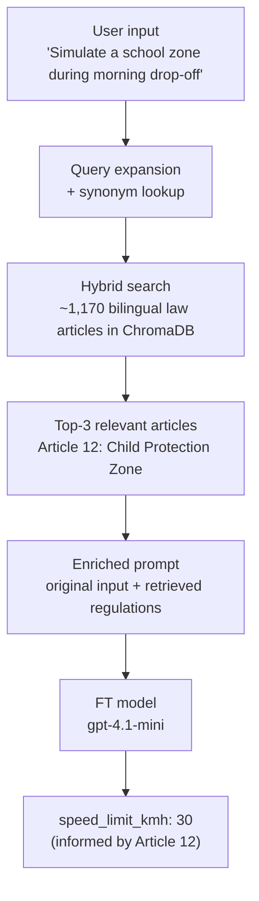

### Data sources

| Source | Articles | Content |
|--------|----------|---------|
| Road Traffic Act (Korean + English) | ~320 | Speed limits, lane rules, signals, pedestrian zones, penalties |
| Enforcement Rules (Korean + English) | ~160 | Facility standards, sign specifications, school zone details |

Full text from [Korean Ministry of Government Legislation](https://law.go.kr), bilingual (Korean original + English translation). Chunked by article pattern (`제X조` / `Article X`), totaling ~1,170 indexed chunks.

### Search pipeline

Each law article is converted into a 1,536-dimensional vector using the OpenAI Embeddings API (`text-embedding-3-small`). Semantically similar texts (e.g., "school zone" and "Child Protection Zone") produce vectors with high cosine similarity. Vectors are stored in ChromaDB, a lightweight in-process vector database.

At query time, the user input is also embedded, then compared against all stored vectors to find the closest matches. Only the top 3 articles are injected into the prompt — enough to provide relevant context without inflating token cost (~400 tokens added per query).

```
1. Query expansion
   → "school zone" + synonym lookup → "child protection zone"
   
2. Embed query → 1,536-dim vector (OpenAI text-embedding-3-small)

3. Hybrid search (embedding 0.6 + keyword 0.4)
   → ChromaDB cosine similarity search (top-10)
   → Keyword scoring with 5x title weight (top-10)
   → Combined ranking → top-3 results

4. Keyword-only fallback (when embeddings unavailable)
```

### Benchmark: FT only vs FT + RAG

Tested on 5 English queries. The FT model was trained on Korean data, so it underperforms on English queries for domain-specific scenarios. RAG compensates by injecting the relevant law articles.

| Scenario | FT only `speed_limit` | FT + RAG `speed_limit` | Source |
|----------|-----------------------|------------------------|--------|
| School zone, morning drop-off | 50 km/h | **30 km/h** | Article 12: Child Protection Zone |
| Construction zone, lane closure | 50 km/h | 50 km/h | — |
| Tunnel, 60 km/h zone | 60 km/h | 60 km/h | — |
| Rainy highway | 80 km/h | 80 km/h | — |
| Autonomous driving test zone | 50 km/h | **30 km/h** | Article 56-3: Autonomous Vehicle |

RAG changed parameters in 2/5 cases where the FT model defaulted incorrectly. In the other 3 cases, the FT model already produced reasonable values.

The FT system prompt covers 5 common scenarios (school zones, highways, etc.), but Korean traffic law contains 240+ articles. RAG ensures that **any regulation the FT has not seen in training** — new policy changes, niche road types, or unusual conditions — can still inform parameter extraction at inference time.

### Design choices

- **Bilingual indexing**: both Korean law text and English translation are indexed, enabling cross-language search
- **Article-level chunking** over fixed-size: law articles are self-contained semantic units
- **Hybrid search**: embedding similarity alone is insufficient for short queries; keyword boosting with query expansion improves accuracy from 0/5 to 4/5
- **Non-invasive injection**: regulations are appended to the user message, not the system prompt — FT performance is preserved even if RAG retrieves nothing
- **Cost**: ~$0.00001 per query (embedding) + ~$0.01 per query (FT inference, unchanged)

## Runtime Parameter Wiring and Calibration

The FT model predicts eight fields. Some define the physical road, some describe driver behavior, and `speed_kmh` serves as the validation target for calibration.

### How FT parameters enter the simulation

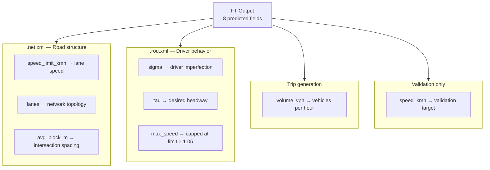

| FT field | Where it goes | SUMO mechanism |
|----------|---------------|----------------|
| `speed_limit_kmh` | `.net.xml` — every non-internal edge/lane `speed` attribute | `apply_speed_limit_to_net()` rewrites lane speeds after `netconvert`; internal junction edges are skipped |
| `lanes` | Network topology | Determines road capacity (OSM: from map data; generated: from FT prediction) |
| `avg_block_m` | Intersection spacing | Controls network structure in generated geometry mode |
| `sigma` | `.rou.xml` — `vType` `sigma` attribute | Krauss car-following model driver imperfection (0 = perfect, 1 = max randomness). Higher sigma → more random braking → lower effective throughput |
| `tau` | `.rou.xml` — `vType` `tau` attribute | Desired time headway in seconds. Higher tau → larger gaps → lower capacity |
| `volume_vph` | `randomTrips.py` trip generation period | `period = duration / total_vehicles`. More vehicles → higher demand → more congestion |
| `max_speed` | `.rou.xml` — `vType` `maxSpeed` | Capped at `speed_limit_kmh / 3.6 × 1.05` to prevent vehicles from exceeding the legal limit |
| `speed_kmh` | Validation target | Compared against simulated average speed; used as calibration reference |

### `speed_limit_kmh` vs `speed_kmh`

`speed_limit_kmh` is the legal speed cap — written into network lane speeds. `speed_kmh` is the predicted average speed under congestion — used only for validation and calibration, not written into SUMO files.

### What the validation error means

After SUMO runs, the system compares:

```
error = (sim_avg_speed − FT_predicted_speed) / FT_predicted_speed × 100%
```

| Grade | Error range | Interpretation |
|-------|-------------|----------------|
| A | ≤ 10% | FT prediction matches simulation well |
| B | ≤ 20% | Acceptable; minor parameter mismatch |
| C | ≤ 30% | Noticeable gap; calibration recommended |
| D | ≤ 50% | Large mismatch; likely geometry or demand issue |
| F | > 50% | Fundamental mismatch between FT prediction and network |

A high error does not necessarily mean the FT model is wrong — it can also mean the generated network geometry doesn't match the road structure the FT model assumed.

### Automatic calibration loop

When the validation error exceeds ±10%, the system can run a closed-loop calibration that nudges behavioral parameters toward the FT-predicted speed target.

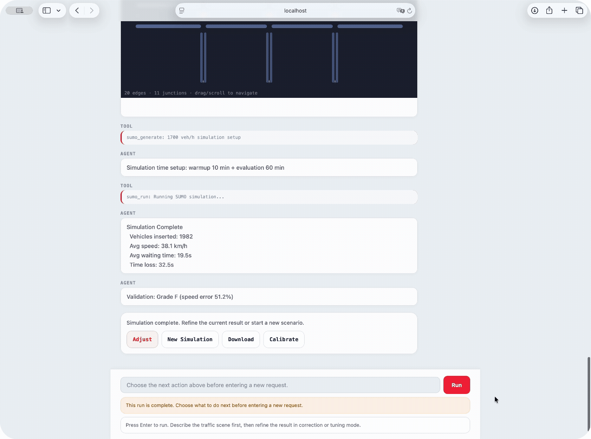

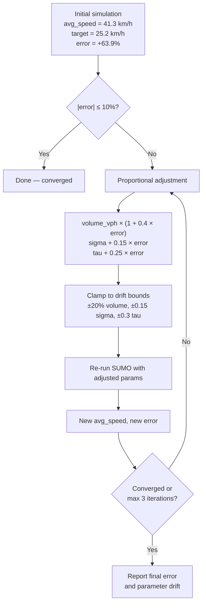

**Design constraints:**

- **Fixed during calibration**: `speed_limit_kmh`, `lanes`, `avg_block_m`, network geometry — these define the physical road and must not change
- **Tunable during calibration**: `volume_vph` (±20%), `sigma` (±0.15), `tau` (±0.3) — these are behavioral parameters with bounded drift
- **Drift caps** prevent calibration from rewriting the FT prediction: even after 3 iterations, parameters stay close to what the model originally predicted

**Why calibration has limits:** calibration adjusts *how vehicles behave* on a given road, not *what the road looks like*. If the network geometry is fundamentally different from what the FT model assumed (e.g., a sparse generated network vs a dense urban grid), no amount of behavioral tuning can close the gap. In those cases, the error signals a geometry mismatch rather than a parameter error.

**Data separation:** calibration results are stored in a separate `calibrated_params_json` column — never mixed with the original FT output (`initial_ft_output_json`). This prevents calibration artifacts from contaminating retraining data.

## Fine-Tuning

### Base model

`gpt-4.1-mini` via the OpenAI Fine-Tuning API. Selected for cost efficiency and low latency in structured extraction tasks.

### Training data generation

[training/build_from_real_data.py](training/build_from_real_data.py) generates supervised pairs from real Seoul traffic detector data (Seoul Metropolitan Government, 2025.10).

#### Data pipeline

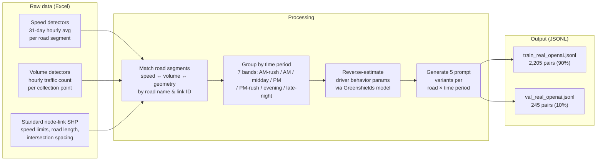

#### What is observed vs. estimated

| Parameter | Source | Method |
|-----------|--------|--------|
| `speed_kmh` | **Observed** | 31-day hourly average from speed detectors |
| `volume_vph` | **Observed** | Hourly average from volume detectors |
| `lanes` | **Observed** | Mode of lane counts across link segments |
| `speed_limit_kmh` | **Observed** (fallback: estimated) | Standard node-link SHP `MAX_SPD`; falls back to road-type heuristic |
| `avg_block_m` | **Observed** | Mean link length from node-link geometry |
| `sigma` | **Estimated** | Greenshields reverse-estimation from observed speed (see below) |
| `tau` | **Estimated** | Greenshields reverse-estimation from observed speed (see below) |
| `reasoning` | **Generated** | Rule-based summary of the above values |

#### Greenshields reverse-estimation

`sigma` (driver imperfection) and `tau` (desired headway) cannot be directly measured from detector data. They are reverse-estimated from observed speed:

$$\text{speed\\_ratio} = \frac{v\_{\text{observed}}}{v\_{\text{free}}} \quad,\quad V/C \approx \max\bigl(0.05,\ 1.0 - \text{speed\\_ratio} \times 0.85\bigr)$$

Then `sigma` and `tau` are calibrated by congestion level (V/C ratio):

| V/C range | sigma | tau |
|-----------|-------|-----|
| > 0.8 (congested) | 0.6 -- 0.8 | 0.8 -- 1.2 s |
| 0.5 -- 0.8 (moderate) | 0.4 -- 0.6 | 1.0 -- 1.5 s |
| < 0.5 (free-flow) | 0.2 -- 0.4 | 1.5 -- 2.5 s |

#### Prompt diversification

> All prompts are originally in Korean. Translated examples below; **bold** marks the compositional elements.

Each (road, time period) pair produces **5 prompt variants** so the model learns from traffic situations, not road name memorization:

| Style | Template | Example |
|-------|----------|---------|
| Road name + time + action | **{road}** **{time}** {action} | "Simulate **Yangjae-daero** **afternoon**" |
| Road name + time | **{road}** **{time}** | "**Yangjae-daero** **afternoon**" |
| Situational (no name) | **{congestion}** **{area}** **{road type}** **{total lanes}**-lane **{time}** | "**moderate** **suburban** **arterial** **8**-lane **afternoon**" |
| Generic type + time | **{total lanes}**-lane **{road type}** **{time}** traffic simulation | "**8**-lane **arterial** **afternoon** traffic simulation" |
| Mixed | **{road}**-like **{road type}** **{time}** conditions | "**Yangjae-daero**-like **arterial** **afternoon** conditions" |

All 5 prompts share the same output parameters (same observed speed, volume, and estimated driver behavior).

#### Example training pair

> Translated from Korean. Actual prompts and reasoning are in Korean.

**Input prompt**: `"moderate suburban arterial 8-lane afternoon"`

**Output JSON**:
```json
{
  "speed_kmh": 27.0,
  "volume_vph": 4460,
  "lanes": 4,
  "speed_limit_kmh": 50,
  "sigma": 0.4,
  "tau": 1.5,
  "avg_block_m": 219,
  "reasoning": "Suburban arterial, 4 lanes/dir, limit 50 km/h. Afternoon avg 27.0 km/h, V/C 0.49. Block spacing 219 m."
}
```

#### Dataset scale

~70 road segments x 7 time periods x 5 prompt variants = **~2,450 total pairs**, split 90/10 into train (2,205) and validation (245).

### Training process

```bash
# Generate dataset from real Seoul detector data
python -m training.build_from_real_data

# Upload and fine-tune
python -m training.fine_tune --provider openai --data training/data/train_real_openai.jsonl --api-key sk-...
```

The fine-tuning job runs on OpenAI's infrastructure with default hyperparameters. The resulting model ID (`ft:gpt-4.1-mini-...:sumo-traffic:...`) is set as `OPENAI_FT_MODEL` in the environment.

### Production inference

```python
# src/llm_parser.py
client.chat.completions.create(
    model="ft:gpt-4.1-mini-...:sumo-traffic-v2:DL1ENw1g",
    messages=[
        {"role": "system", "content": FT_SYSTEM_PROMPT},
        {"role": "user", "content": user_input},
    ],
    temperature=0.2,
    max_tokens=300,
)
```

The model returns a single JSON object. No post-processing beyond `json.loads()` is needed.

## Tool-Calling Agent

The project includes a tool-calling agent ([src/agent.py](src/agent.py)) that autonomously selects and executes tools based on user requests. In API mode, the unified client layer ([src/llm_client.py](src/llm_client.py)) supports Claude, Gemini, and GPT backends; in CLI mode, local `gemini`, `claude`, or `codex` binaries can still be used for local experimentation, though CLI responses are text-only rather than structured tool calls.

### Available tools (11)

| Tool | Description |
|------|-------------|
| `search_location` | Geocode area names to coordinates |
| `build_road_network` | Build SUMO network from OSM |
| `get_traffic_stats` | Query local Seoul traffic statistics |
| `generate_simulation` | Generate SUMO config files |
| `run_sumo` | Execute simulation |
| `query_topis_speed` | Real-time Seoul traffic API |
| `load_csv_data` | Load external traffic data |
| `recommend_road` | Suggest similar roads |
| `find_similar_roads` | Find roads matching criteria |
| `validate_simulation` | Validate simulation output |
| `calibrate_params` | Calibrate parameters from results |

### Agent loop

```text
User input -> LLM selects tool -> tool execution -> result returned
-> LLM selects next tool or gives final response -> repeat
```

The agent layer uses LLM tool-use. The base LLM is configurable across Claude, GPT, and Gemini.

### Example: agent-driven flow (separate from the FT pipeline)

The agent autonomously selects tools — this is a different path from the FT-based pipeline used in server.py/chat.py. Here the LLM itself decides which tools to call:

Input: `"simulate a congested commute road"`

```text
1. search_location("commute road") -> no specific location found
2. get_traffic_stats("arterial", "rush hour") -> query local statistics DB for reference values
3. generate_simulation(params) -> .net.xml, .rou.xml, .sumocfg created
4. run_sumo("output/generated.sumocfg") -> avg speed 22.3 km/h, 1850 vehicles
5. validate_simulation(results) -> grade B, speed error -8.2%
   -> Final response with results summary
```

## Fine-Tuning Evaluation

### Benchmark method

30 prompts are sampled from the real-data validation set (~245 samples). Each prompt is sent to both the fine-tuned model and the base model (`gpt-4.1-mini`) with the same system prompt. The model output is parsed as JSON and compared field-by-field against ground truth values derived from observed Seoul traffic data. Metrics: MAPE (mean absolute percentage error) per field, directional bias (over/under-prediction), and output consistency (coefficient of variation across repeated runs).

### Accuracy (MAPE %, lower is better)

| Field | Fine-tuned | Base (gpt-4.1-mini) |
|-------|-----------|---------------------|
| speed_kmh | **5.1%** | 74.6% |
| volume_vph | **34.8%** | 48.1% |
| lanes | **8.9%** | 13.9% |
| speed_limit_kmh | **1.7%** | 23.8% |
| sigma | **4.5%** | 21.3% |
| tau | **4.6%** | 11.4% |
| avg_block_m | **14.5%** | 167.6% |
| **Overall** | **10.6%** | **51.5%** |

The fine-tuned model reduces overall MAPE by ~5x. Output consistency is also higher: CV of 1.47% vs 3.89% for the base model.

### Error Pattern Analysis

Directional bias analysis across 30 samples reveals where each model systematically over- or under-predicts:

| Field | FT Bias | FT Accurate | Base Bias | Base Accurate |
|-------|---------|-------------|-----------|---------------|
| speed_kmh | +0.5% (balanced) | 21/30 | **+68.3% (overpredict)** | 0/30 |
| volume_vph | +25.9% (over) | 13/30 | +21.4% (over) | 3/30 |
| speed_limit_kmh | -1.7% (balanced) | 29/30 | +15.7% (over) | 11/30 |
| sigma | -0.9% (balanced) | 24/30 | +9.9% (over) | 6/30 |
| tau | +1.6% (balanced) | 20/30 | +0.9% (over) | 3/30 |
| avg_block_m | -0.6% (balanced) | 20/30 | **+165.0% (overpredict)** | 1/30 |

Key findings:

- **Base model systematically overpredicts speed** (+68.3% bias, 0/30 accurate). This is the strongest signal that fine-tuning corrects: the base model defaults to free-flow speeds while the FT model learns congested-condition patterns.
- **Base model overpredicts intersection spacing** by 165%, suggesting it lacks domain knowledge about urban block structures.
- **FT volume_vph** has the highest remaining error (MAPE 34.8%, +25.9% bias). This is expected — volume is the most context-dependent field and would benefit most from additional training data covering a wider range of scenarios.
- **FT speed_limit_kmh** is near-perfect (29/30 accurate), showing the model reliably maps road categories to legal speed limits.

### Improvement opportunity

The `volume_vph` field shows the most room for improvement and would benefit from additional training data covering a wider range of traffic volume scenarios.

Reproduce with:

```bash
python -m evaluation.benchmark --accuracy --samples 30
python -m evaluation.benchmark --all
```

## Dataset

| Source | Samples | Format | Ground Truth |
|--------|---------|--------|--------------|
| Real-data (Seoul) | 2,205 train + 245 val | OpenAI JSONL | Observed speed/volume from Seoul traffic data |
| Corrections | grows | Exportable JSONL | Human expert corrections on FT outputs |
### Real-data-derived — [training/build_from_real_data.py](training/build_from_real_data.py)

~70 road segments from Seoul traffic detectors × 7 time periods × 5 prompt variants = ~2,450 pairs (2,205 train + 245 validation). Observed speed/volume paired with rule-based natural language prompts in multiple styles (road name, situational description, mixed). Driver parameters reverse-estimated from observed speed. The model learns situation-to-parameter mapping, not road name lookup.

### Path 3: Correction-derived — [src/session_db.py](src/session_db.py)

When a user edits a result, the system classifies intent as **Correction** (trainable) or **Tuning** (analysis only). Corrections are stored in SQLite with before/after parameter snapshots, modification type (`parameter` / `geometry` / `mixed`), and a trainability flag. Only correction-intent records are exported as retraining JSONL.

```text
prompt -> FT prediction -> simulation -> user review
  -> Correction: stored with trainable=1
  -> Tuning: stored with trainable=0

export_corrections_for_training()
  -> SELECT WHERE trainable=1 AND intent='correction'
  -> sessions_corrections_openai.jsonl
  -> merge with train_real_openai.jsonl -> re-fine-tune
```

| SQLite field | Purpose |
|---|---|
| `edit_intent` | "correction" or "tuning" |
| `trainable` | 1 = exportable, 0 = analysis only |
| `modification_type` | parameter / geometry / mixed |
| `details_json` | Before/after parameter snapshots |

## Role-Separated LLM Design

### Fine-tuned extractor — [src/llm_parser.py](src/llm_parser.py)

- Parses natural language into structured simulation parameters
- Provides the machine-readable target for the rest of the pipeline

### Geometry LLM — [src/base_llm.py](src/base_llm.py)

- **Classifies modification requests**: receives user edit, returns `parameter`, `geometry`, or `mixed` (keyword heuristic fallback on LLM failure)
- Routes parameter edits to the FT extractor, geometry edits to XML regeneration, mixed to both
- Handles road layout reasoning and generates fallback `.nod.xml` / `.edg.xml` when OSM fails
- Configurable across Claude, GPT, and Gemini

### Tool-calling agent — [src/agent.py](src/agent.py)

- 11-tool orchestration via LLM tool-use
- Autonomous tool selection based on user intent
- Multi-turn execution loop

### Logging and export — [src/session_db.py](src/session_db.py)

- Stores simulation runs and modification sessions in SQLite
- Separates trainable corrections from non-trainable tuning
- Exports retraining JSONL via `export_corrections_for_training()`
- Admin dashboard at `/admin` shows correction history, modification breakdowns, and downloadable exports

## Evaluation and Admin

Database-backed evaluation workflow with auditable, reusable results.

- **LLM-level**: field error rates, correction frequency, average deltas
- **System-level**: scenario fidelity through speed validation and correction statistics

### Admin dashboard (`/admin`)

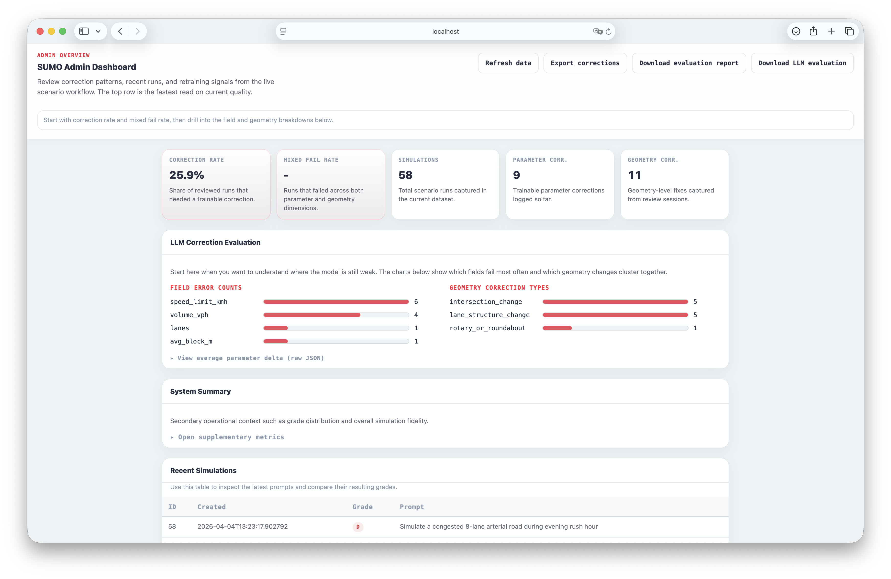

| Panel | Content |
|-------|---------|
| Top cards | Correction rate, mixed fail rate, total simulations, parameter/geometry correction counts |
| LLM Correction Evaluation | Per-field error bar charts, geometry correction type breakdown, average parameter deltas |
| Recent Simulations | Prompt, grade (A/B/C/D), timestamp — latest 30 runs |
| Recent Modifications | Edit intent, modification type, trainable flag, user input — latest 50 edits |

Downloadable exports:
- **Corrections JSONL** — trainable correction records for re-fine-tuning
- **Evaluation report** — grade distribution, fidelity summary
- **LLM evaluation report** — field-level error analysis, parameter deltas, geometry categories

Every correction is traceable: user edit → SQLite → admin panel → exported JSONL → re-fine-tune.

## Token Usage and Cost Observability

Every LLM API call in the system is instrumented through a centralized `TokenTracker` singleton ([src/token_tracker.py](src/token_tracker.py)). Each call automatically records provider, model, input/output tokens, latency, and estimated cost — exposed live at `GET /api/admin/token-usage`.

### Instrumented call sites

| File | Caller tag | What it tracks |
|------|-----------|----------------|
| [src/llm_parser.py](src/llm_parser.py) | `parser`, `parser_ft` | Parameter extraction (FT GPT-4.1-mini / Claude fallback) |
| [src/base_llm.py](src/base_llm.py) | `base_llm` | XML generation, classification, modification (Gemini/GPT/Claude) |
| [src/llm_client.py](src/llm_client.py) | `agent` | Tool-calling agent loop |

Token counts are pulled directly from each provider's response (`resp.usage.prompt_tokens`, `msg.usage.input_tokens`, `resp.usage_metadata.prompt_token_count`), then priced via a per-model lookup table with fuzzy matching for fine-tuned model IDs.

### Measured cost per session

Production prompt: `"강남역 퇴근시간 8차로 간선도로 시뮬레이션"`, new simulation + 1 parameter correction + 1 geometry correction.

| Mode | LLM calls | Total tokens | Cost | vs Baseline |
|------|----------:|-------------:|-----:|------------:|
| **FT + Gemini (current)** | 6 | 2,350 | **$0.001** | 1x |
| GPT-4.1-mini Agent | 6–8 turns | ~14,500 | $0.007 | 7x |
| Opus Agent | 6–8 turns | ~14,500 | $0.248 | 235x |

### Why the current architecture wins

- **Fine-tuning eliminates agent turns.** FT GPT-4.1-mini extracts all 8 parameters in a single 251→103 token call; an agent must re-send the 833-token system prompt + 1,826-token tool schemas (**2,659 tokens overhead per turn**) across 6–8 turns.
- **Model tiering (right model for the job).** FT GPT-4.1-mini for structured extraction, Gemini 2.5 Flash for long XML generation and trivial classifications, Claude reserved for fallback. No task requires a frontier model.
- **Domain knowledge in weights, not context.** Fine-tuning moves the traffic-engineering rules into the parser's weights, so in-context reasoning (and its token cost) is unnecessary.

### Live endpoint

```
GET /api/admin/token-usage
→ { "summary": { "total_calls": 6, "input_tokens": 1158, "output_tokens": 1192,
                 "total_cost_usd": 0.001055, "total_latency_ms": 30286,
                 "by_model": { ... } },
    "calls": [ { "provider", "model", "caller", "input_tokens",
                 "output_tokens", "latency_ms", "cost_usd", "timestamp" }, ... ] }
```

See [docs/TOKEN_COST_ANALYSIS.md](docs/TOKEN_COST_ANALYSIS.md) for the full measurement methodology, per-call breakdown, pricing reference, and scaling projections.

## Project Structure

```text
.
├── main.py                      # Single-shot pipeline entrypoint
├── chat.py                      # Terminal chat / setup wizard
├── server.py                     # Web backend and orchestration
├── web/
│   ├── index.html               # Interactive generation UI
│   ├── admin.html               # Admin / evaluation dashboard
│   └── about.html               # Project landing page
├── src/
│   ├── llm_parser.py            # Fine-tuned parameter extraction
│   ├── base_llm.py              # Base-model geometry + modification
│   ├── llm_client.py            # Multi-provider LLM abstraction
│   ├── agent.py                 # Tool-calling agent (11 tools)
│   ├── session_db.py            # Simulation / correction DB and exports
│   ├── validator.py             # Simulation validation
│   └── config.py                # Runtime configuration
├── tools/
│   ├── osm_network.py           # OSM-based network creation
│   ├── sumo_generator.py        # SUMO route/config generation
│   ├── topis_api.py             # Seoul real-time traffic lookup
│   ├── similar_road.py          # Statistical fallback by road similarity
│   └── network_generator.py     # Fallback synthetic network
├── traffic_data/
│   └── traffic_db.py            # Representative Seoul traffic statistics
├── training/
│   ├── generate_dataset.py      # Synthetic FT dataset generation
│   ├── build_from_real_data.py  # Real-data FT dataset building
│   └── fine_tune.py             # FT workflow helper
├── evaluation/
│   └── benchmark.py             # FT vs base accuracy benchmark
├── data_pipeline/
│   ├── collector.py             # Traffic data collection
│   └── schema.py                # Collector DB schema
├── .github/workflows/
│   └── ci.yml                   # Test / build / deploy pipeline
└── tests/                       # pytest test suite
```

## Running the Project

### Prerequisites

Runtime scenario generation depends on a working SUMO installation:

- `sumo` and `netconvert` are required for headless execution and OSM conversion
- `sumo-gui` is optional, but needed for `/view` and browser-launched GUI inspection
- `randomTrips.py` must be discoverable from the SUMO Python package or `SUMO_HOME/tools`

If these binaries are not on `PATH`, the app can be pointed at custom locations with `SUMO_BIN` and `NETCONVERT_BIN`.

### Local (recommended for development)

Recommended when local LLM CLIs (gemini, claude, codex) are installed. Docker containers cannot access host CLI tools due to OAuth authentication requirements, so native execution is preferred for full functionality.

```bash
python -m venv .venv
source .venv/bin/activate
pip install -r requirements.txt
python server.py
```

### Run modes

Three entrypoints are useful during development:

```bash
# Browser UI + admin dashboard
python server.py

# Terminal setup wizard + chat commands (/status, /traffic, /view)
python chat.py

# Single-shot pipeline run
python main.py "강남역 퇴근시간 시뮬레이션해줘"
```

The browser UI is the most complete workflow: it supports correction/tuning refinement, network preview, artifact downloads, and admin-side evaluation views.

### Docker

```bash
docker compose up --build
```

Then open:
- `http://localhost:8080/` — simulation UI
- `http://localhost:8080/admin` — admin dashboard
- `http://localhost:8080/about` — project overview

Docker is the easiest way to get SUMO itself running, but local execution remains the best option when you want to reuse host-installed LLM CLIs for geometry/base-model reasoning.

### Environment Variables

Copy `.env.example` to `.env` and fill in:

| Variable | Required | Description |
|----------|----------|-------------|
| `OPENAI_API_KEY` | Recommended | Required when using OpenAI fine-tuned extraction; not needed for pure rule-based runs |
| `OPENAI_FT_MODEL` | Recommended | Fine-tuned model ID used by the extraction stage |
| `TOPIS_API_KEY` | No | Seoul real-time traffic API; without it the app falls back to local representative statistics |
| `ANTHROPIC_API_KEY` | No | Claude API for geometry/base LLM or agent mode |
| `GEMINI_API_KEY` | No | Gemini API for agent or base-LLM use |
| `SUMO_BIN` | No | Override path to the `sumo` executable |
| `NETCONVERT_BIN` | No | Override path to the `netconvert` executable |
| `SUMO_HOME` | No | Helps locate `randomTrips.py` under `SUMO_HOME/tools` |
| `BASE_LLM_MODE` | No | `api` or `cli` for geometry/base-model requests |
| `BASE_LLM_CLI` | No | Preferred local CLI (`gemini`, `claude`, `codex`) when `BASE_LLM_MODE=cli` |
| `BASE_LLM_SHARED_PROVIDER` | No | Shared server-side base-LLM provider name (`gemini`, `claude`, `gpt`) |
| `BASE_LLM_SHARED_MODEL` | No | Shared server-side base-LLM model override |
| `BASE_LLM_SHARED_KEY` | No | Shared server-side base-LLM API key |

The checked-in `.env.example` is intentionally minimal. For local development, it is normal to add only the variables relevant to the path you are testing.

## CI/CD and Deployment

### GitHub Actions Pipeline

Pushes to `main` trigger:

1. **test** — `pytest tests/`
2. **docker-build** — build image and verify container health
3. **deploy** — deploy to Cloud Run (when secrets are configured)

### GCP Cloud Run

| Secret | Description |
|--------|-------------|
| `GCP_PROJECT_ID` | GCP project ID |
| `GCP_SA_KEY` | Service account JSON key |

The sample GitHub Actions deployment in [.github/workflows/ci.yml](.github/workflows/ci.yml) also injects runtime config for the currently enabled production path:

- `OPENAI_API_KEY`
- `OPENAI_FT_MODEL`
- `TOPIS_API_KEY`

`TOPIS_API_KEY` remains optional from an application perspective because the server can fall back to representative statistics. If your production setup instead relies on a preconfigured shared Gemini/base-LLM credential outside this repository, update the Cloud Run deploy step to match that environment.

Deployment target: `asia-northeast1` (Tokyo), 1Gi memory, max 3 instances.

## Testing

```bash
pytest tests/ -v
```

Covers configuration loading, validation logic, correction storage/export, and chat session parsing. The CI workflow also performs a Docker smoke test by booting the container and checking `/api/status`.

## Lessons Learned

- **Structured extraction is a better fine-tuning target than open-ended generation.** Parameter extraction with constrained JSON output converged quickly (~2,250 training pairs from ~70 road segments), while geometry/XML generation is too open-ended to fine-tune with the same approach.
- **Geometry generation is the clearest fine-tuning gap.** Road layout and XML generation still rely on a general-purpose LLM with in-context examples because fine-tuning requires structured geometry datasets and significantly more API budget than was available. This is the most impactful next step if resources allow.
- **LLM-generated geometry is good for bulk generation but not for precise reproduction.** The current system excels at producing plausible road networks from text descriptions at scale, but it cannot faithfully reconstruct the exact geometry a user has in mind. A future direction is a visual editor — drawing tool where users sketch road lines that become network XML directly, or a SimCity-style block composition interface where predefined road/intersection tiles snap together. This would complement the LLM pipeline: text-to-scenario for rapid generation, visual editor for precise control.
- **Volume is the hardest field to predict.** At 34.8% MAPE it is the FT model's weakest point — volume is the most context-dependent parameter and would benefit most from additional training data covering a wider range of scenarios.
- **External dependencies need graceful fallback.** OSM lookups and public APIs fail often enough that the LLM-generated XML fallback path is not optional — it is a core part of the pipeline.
- **Evaluation should include cross-domain generalization.** The current benchmark covers Seoul roads; testing on unseen cities or road types would reveal how much the model has learned general traffic engineering vs Seoul-specific patterns.

## License

All rights reserved. This repository is shared for portfolio and evaluation purposes only. See [LICENSE](LICENSE).
