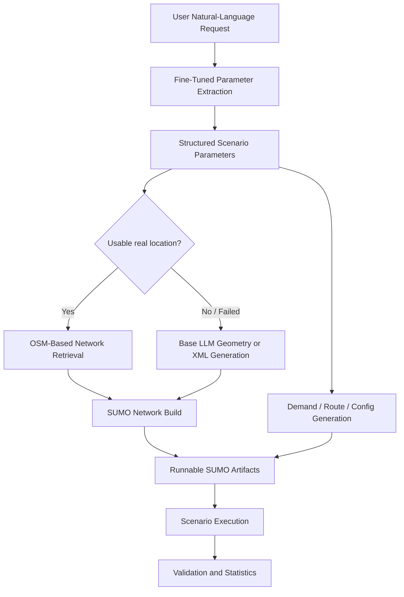
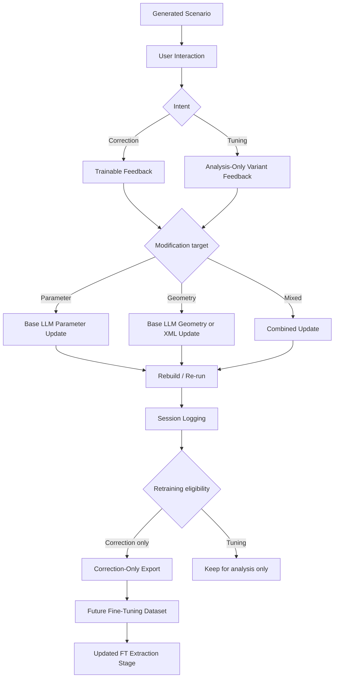

# LLM-Guided Synthetic Driving Scenario Generation Workflow

This project converts natural-language traffic requests into structured synthetic driving scenarios in SUMO, closing the loop with correction logging, evaluation, and retraining exports.

The repository focuses on:

- structured dataset generation
- domain-specific fine-tuning
- role-separated model and tool orchestration
- human-in-the-loop correction logging
- evaluation and improvement loops

## Overview

Building realistic synthetic driving scenarios is tedious and domain-heavy. This project addresses that through a role-separated LLM workflow:

1. A user describes a traffic scene in natural language.
2. A fine-tuned model extracts structured simulation parameters.
3. A base LLM handles open-ended geometry and XML reasoning.
4. The system generates or modifies SUMO artifacts and executes the scenario.
5. Results are validated, and human corrections are logged for future dataset improvement.

The key design choice is responsibility split rather than a single model doing everything:

- Fine-tuned model:
  - maps `natural language -> structured traffic parameters`
  - predicts fields such as `speed_kmh`, `volume_vph`, `lanes`, `speed_limit_kmh`, `sigma`, `tau`, and `avg_block_m`
- Base LLM:
  - handles modification classification and geometry/XML reasoning
  - edits network structure or generates fallback XML
- Tool / pipeline layer:
  - builds SUMO files, runs scenarios, validates outputs, and stores logs and reports

## Architecture at a Glance

### End-to-End Generation Flow



### Human-in-the-Loop Refinement and Retraining Flow



## Pipeline

Example input:

```text
"Create a congested morning intersection in front of an elementary school."
```

### 1. Fine-tuned parameter extraction

The fine-tuned OpenAI model converts the user request into a structured parameter set.

Target fields include:

- `speed_kmh`
- `volume_vph`
- `lanes`
- `speed_limit_kmh`
- `sigma`
- `tau`
- `avg_block_m`
- `reasoning`

### 2. Network generation or retrieval

- If a usable real location is available, the system tries to build a road network from OSM.
- If OSM lookup fails or the request is abstract, a base LLM generates `.nod.xml` and `.edg.xml`.
- The generated XML is converted into a runnable SUMO network with `netconvert`.

### 3. Scenario execution and refinement

The pipeline creates:

- `.net.xml`
- `.rou.xml`
- `.add.xml`
- `.sumocfg`

Traffic demand is generated from the extracted parameters, then SUMO runs in headless mode.

After generation, the user can continue the session in two different ways:

- `Correction`
  - marks the result as wrong
  - becomes trainable feedback
- `Tuning`
  - requests another acceptable variant
  - is logged but excluded from retraining by default

This prevents preference edits from polluting fine-tuning or dataset-improvement signals.

## Fine-Tuning Data and Logging

The project uses three data paths for fine-tuning and later improvement.

### Synthetic dataset path

- [training/generate_dataset.py](training/generate_dataset.py)

This script builds supervised prompt/target pairs from:

- named roads
- abstract traffic situations
- time-of-day scenarios
- road categories
- weather conditions
- traffic engineering heuristics for capacity and congestion

### Real-data-derived dataset path

- [training/build_from_real_data.py](training/build_from_real_data.py)

This stage loads observed Seoul speed and volume files, aggregates them by road and time period, and converts them into structured FT targets.

### Correction-derived retraining path

- [src/session_db.py](src/session_db.py)

When a user corrects a generated result, the system stores:

- the simulation state
- modification history
- correction intent
- before/after snapshots
- trainability metadata

Those records can later be exported into JSONL again:

```text
prompt -> FT prediction -> scenario execution -> human correction -> DB -> export -> retraining
```

## Role-Separated LLM Workflow

### Fine-tuned extractor

Implemented in [src/llm_parser.py](src/llm_parser.py)

Responsibilities:

- parses natural language into structured simulation parameters
- provides the machine-readable target for the rest of the pipeline

### Base LLM geometry / modification layer

Implemented in [src/base_llm.py](src/base_llm.py)

Responsibilities:

- classifies modification requests
- handles geometry edits
- generates fallback XML
- extracts FT training hints from geometry edits when useful

Some fields, such as `lanes` or `avg_block_m`, are meaningful as FT targets but operationally applied through geometry changes.

### Logging, export, and reporting layer

Implemented in [src/session_db.py](src/session_db.py), [server.py](server.py), [web/index.html](web/index.html), and [web/admin.html](web/admin.html)

Responsibilities:

- stores simulation runs and modification sessions
- separates trainable corrections from non-trainable tuning requests
- builds downloadable reports
- exports retraining JSONL

## Evaluation and Admin Layer

The project uses a database-backed evaluation workflow so that results remain auditable and reusable.

Current admin capabilities include:

- simulation and modification history
- correction-focused evaluation summaries
- field error counts, average deltas, and geometry correction categories
- correction export and downloadable reports

The current evaluation view has two levels:

- LLM-level evaluation:
  - how often extracted fields required human correction
  - which fields were corrected most often
  - average correction deltas by field
- system-level evaluation:
  - whether the executed scenario behaves close to the intended scene description
  - currently tracked mainly through speed-related fidelity and correction statistics

## Why This Project Is Relevant to AD/ADAS LLM Workflows

This repository is relevant to AD/ADAS-oriented LLM work because it demonstrates:

- fine-tuning for structured scenario-parameter generation
- construction of a dataset generation pipeline
- human-in-the-loop quality control
- correction logging and retraining export
- evaluation and error analysis

The project is clearly LLM-first, not VLM-first. Its relevance is in the workflow pattern: define a structured target, capture corrections, and feed validated signals back into training.

## Repository Structure

```text
.
├── server.py                     # local web backend and orchestration
├── web/
│   ├── index.html               # interactive generation UI
│   └── admin.html               # admin / evaluation UI
├── src/
│   ├── llm_parser.py            # fine-tuned parameter extraction
│   ├── base_llm.py              # base-model geometry + modification logic
│   ├── session_db.py            # simulation / correction DB and exports
│   ├── validator.py             # simulation validation
│   └── config.py                # runtime configuration
├── tools/
│   ├── osm_network.py           # OSM-based network creation
│   ├── sumo_generator.py        # SUMO route/additional/config generation
│   └── network_generator.py     # fallback synthetic network generation
├── training/
│   ├── generate_dataset.py      # synthetic FT dataset generation
│   ├── build_from_real_data.py  # real-data FT dataset building
│   └── fine_tune.py             # FT workflow helper
├── data_pipeline/
│   └── collector.py             # traffic data collection utilities
└── raw_data/                    # source traffic files
```

## Running the Project

### Option A: Local Python (recommended for development)

This is the most practical option when the machine already has local LLM CLIs installed and you want to run `server.py` directly.

```bash
python -m venv .venv
source .venv/bin/activate
pip install -r requirements.txt
python server.py
```

### Option B: Docker

```bash
# Build and run with docker compose
docker compose up --build

# Or run directly with Docker
docker build -t sumo-traffic-agent .
docker run -p 8080:8080 --env-file .env sumo-traffic-agent
```

Then open:

- `http://localhost:8080/` — simulation UI
- `http://localhost:8080/admin` — admin / evaluation dashboard

### Environment Variables

Copy `.env.example` to `.env` and fill in:

| Variable | Required | Description |
|----------|----------|-------------|
| `OPENAI_API_KEY` | Yes | For fine-tuned parameter extraction |
| `OPENAI_FT_MODEL` | Yes | Fine-tuned model ID (e.g., `ft:gpt-4.1-mini-...`) |
| `TOPIS_API_KEY` | No | Seoul real-time traffic API |
| `ANTHROPIC_API_KEY` | No | Claude API for optional base LLM usage |
| `GEMINI_API_KEY` | No | Gemini API |

### Fine-tuning dataset generation

```bash
# Synthetic dataset
python -m training.generate_dataset

# Real-data-derived dataset
python -m training.build_from_real_data
```

### Export correction-based retraining data

Available from the admin page, or through the backend export flow in:

- [src/session_db.py](src/session_db.py)

## CI/CD and Deployment

### CI/CD Pipeline (GitHub Actions)

Pushes to `main` trigger:

1. **test** — runs `pytest tests/` (15 tests)
2. **docker-build** — builds the Docker image and verifies container health
3. **deploy** — deploys to Cloud Run when the required secrets are configured

### GCP Cloud Run Deployment

Automatic deployment requires these GitHub Secrets:

| Secret | Description |
|--------|-------------|
| `GCP_PROJECT_ID` | GCP project ID |
| `GCP_SA_KEY` | Service account JSON key (with Cloud Run, Artifact Registry, Secret Manager permissions) |

GCP prerequisites:

```bash
# Create Artifact Registry repository
gcloud artifacts repositories create docker-repo \
  --repository-format=docker --location=asia-northeast1

# Store API keys in Secret Manager
echo -n "sk-..." | gcloud secrets create openai-api-key --data-file=-
echo -n "..." | gcloud secrets create topis-api-key --data-file=-
```

Deployment target: `asia-northeast1` (Tokyo), 1Gi memory, max 3 instances.

## Fine-Tuning Evaluation

Benchmark comparing the fine-tuned model against the base model (`gpt-4.1-mini`) on 30 held-out validation samples with ground truth labels derived from real Seoul traffic data.

### Accuracy (MAPE %, lower is better)

| Field | Fine-tuned | Base (gpt-4.1-mini) |
|-------|-----------|---------------------|
| speed_kmh | **5.1%** | 74.6% |
| volume_vph | **34.8%** | 48.1% |
| lanes | **8.9%** | 13.9% |
| speed_limit_kmh | **1.7%** | 23.8% |
| sigma | **4.5%** | 21.3% |
| tau | **4.6%** | 11.4% |
| avg_block_m | **14.5%** | 167.6% |
| **Overall** | **10.6%** | **51.5%** |

The fine-tuned model reduces overall MAPE by ~5x compared to the base model. The largest improvement is in `speed_kmh` (5.1% vs 74.6%), where the base model consistently overestimates realistic traffic speeds. Output consistency is also higher: the fine-tuned model produces a coefficient of variation of 1.47% across repeated runs, compared to 3.89% for the base model.

Reproduce with:

```bash
python -m evaluation.benchmark --accuracy --samples 30
python -m evaluation.benchmark --all  # includes consistency benchmark
```

## Current Strengths

- clear role separation across FT extraction, base-model geometry reasoning, and the tool layer
- correction vs tuning split to protect retraining data quality
- structured logging and correction-derived retraining export
- admin UI for evaluation summaries and report download
- synthetic and real-data fine-tuning dataset paths
- end-to-end flow from prompt to retraining export

## Current Limitations

- stronger in LLM workflow design than in frontend polish
- geometry editing remains more fragile than parameter extraction
- external dependencies such as OSM and public APIs can fail
- some SUMO behavior parameters are not yet fully calibrated in the closed loop
- the fine-tuned model was trained on a limited dataset (~70 samples); accuracy is expected to improve with more training data and additional epochs
- evaluation covers accuracy and consistency but does not yet include cross-domain generalization tests
